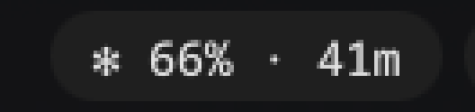
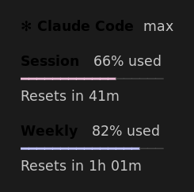

# claude-usage-noctalia-hyprland

A Claude Code usage indicator for the [Noctalia](https://github.com/noctalia-dev/noctalia-shell) bar.

The bar shows your **5‑hour session** usage and when it resets. Hover for a card
with **Session** and **Weekly** progress bars — styled to your active Noctalia theme.





## How it works

It reads the same OAuth usage endpoint Claude Code's own statusline uses
(`api.anthropic.com/api/oauth/usage`), using the access token that your running
`claude` sessions keep fresh in `~/.claude/.credentials.json`.

It is **read‑only**: it never writes your credentials file, so there is no risk of
corrupting the rotating refresh token. Results are cached for 60 s. If the token is
briefly expired (no `claude` running), it serves the last good cache.

Two small scripts:

- `claude-usage` — fetches + caches the usage JSON.
- `claude-usage-noctalia` — formats it for a Noctalia `CustomButton`
  (`{text, tooltip, color}`), pulling colors live from
  `~/.config/noctalia/colors.json` so it always matches your theme.

## Requirements

- [Noctalia](https://github.com/noctalia-dev/noctalia-shell) (QuickShell)
- `jq`, `curl`, GNU `date` (coreutils)
- A logged‑in Claude Code (Pro/Max) — i.e. `~/.claude/.credentials.json` exists

## Install

```sh
install -Dm755 bin/claude-usage          ~/.local/bin/claude-usage
install -Dm755 bin/claude-usage-noctalia ~/.local/bin/claude-usage-noctalia
```

Make sure `~/.local/bin` is on your `PATH`.

## Add it to the bar

Add a `CustomButton` to `~/.config/noctalia/settings.json` under
`bar.widgets.left` / `center` / `right`:

```json
{
  "id": "CustomButton",
  "showIcon": false,
  "icon": "",
  "textCommand": "claude-usage-noctalia",
  "parseJson": true,
  "textStream": false,
  "textIntervalMs": 30000,
  "hideMode": "alwaysExpanded",
  "maxTextLength": { "horizontal": 18, "vertical": 6 },
  "leftClickUpdateText": true,
  "showTextTooltip": true,
  "showExecTooltip": false
}
```

Noctalia watches `settings.json` and reloads automatically. The bar updates every
30 s; the underlying usage call is cached for 60 s.

> Tip: if your `~/.local/bin` isn't on Noctalia's `PATH`, use the absolute path in
> `textCommand` (e.g. `/home/you/.local/bin/claude-usage-noctalia`).

## Customizing

- **Icon** — the `✻` is a literal character in the script (Noctalia's bar icon
  slot only takes Tabler glyph names, so a literal char is used for the text).
  Change it in `claude-usage-noctalia`.
- **Colors / thresholds** — session uses your theme's *tertiary*, weekly your
  *primary*, switching to *error* at ≥ 90%. The bar text accents at ≥ 75%. All in
  `claude-usage-noctalia`.
- **Refresh** — `textIntervalMs` (bar redraw) and the 60 s cache in `claude-usage`.

## License

MIT
